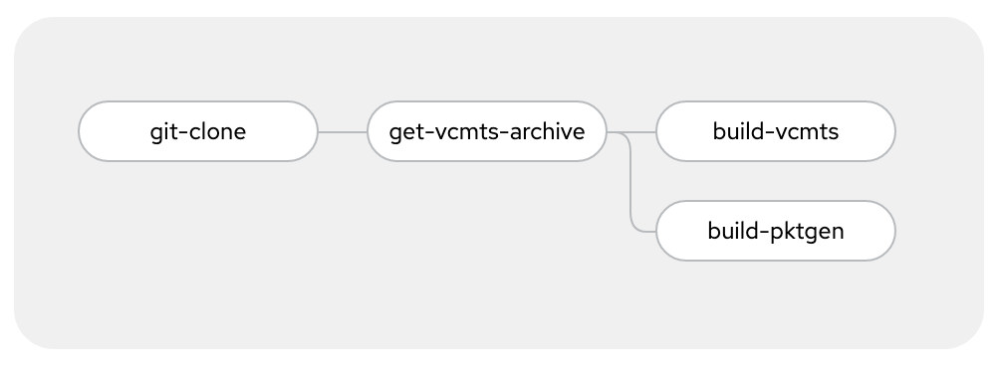

# Intel vCMTS on OpenShift

## Table of Contents

<!-- TOC -->
- [Intel vCMTS on OpenShift](#intel-vcmts-on-openshift)
  - [Introduction](#introduction)
  - [Prerequisities](#prerequisities)
  - [Architecture](#architecture)
  - [Build Container Images](#build-container-images)
    - [Pipeline Build](#pipeline-build)
    - [Local Build](#local-build)
  - [SRIOV Config](#sriov-config)
  - [Deploy the application](#deploy-the-application)
<!-- TOC -->

## Introduction

This document describes how to build, install and run the Intel vCMTS reference dataplane system on Red Hat OpenShift Container Platform. Intel vCMTS includes a DPDK Pktgen based cable traffic generation system for upstream and downstream traffic simulation.

## Prerequisities

  - Red Hat OpenShift version 4.9
  - Podman
  - Buildah
  - Helm3
  - Intel vCMTS Package
  - OpenShift Container Storage
  - [OpenShift Pipeline](https://docs.openshift.com/container-platform/4.9/cicd/pipelines/installing-pipelines.html)

## Architecture

## Build Container Images

### Pipeline Build

#### OpenShift Pipeline

This requires [OpenShift Pipelines](https://docs.openshift.com/container-platform/4.9/cicd/pipelines/installing-pipelines.html) to be installed.

Start by creating the namespace in which the pipeline will be deployed:

~~~
$ oc create ns vcmts-build
~~~

##### Authentication to git repository

In order for the pipeline to authenticate to the Github repository, you must provide have a key-pair with the public key in your Github account, and load the private key into the OpenShift project.

See the `github-auth-secret_EXAMPLE.yaml` and replace `YOUR_BASE64_ENCODED_PRIVATE_KEY` with your encoded private key.

Then apply the secret:
~~~
$ oc create -f pipeline/github-auth-secret_EXAMPLE.yaml
~~~

##### Authentication to internal image registry

~~~
oc policy add-role-to-user registry-editor -z pipeline -n vcmts-build
~~~

##### Pipeline share workspace

In order to pass data between the pipeline tasks, a shared workspace is setup.

~~~
oc apply -f pipeline/vcmts-build-workspace-pvc.yaml
~~~

##### Pipeline tasks

The pipeline is comprised of 4 tasks, as follow:



The details for the `get-vcmts-archive` and `build-*` tasks are in `pipeline/tasks` folder

Create the tasks:

~~~
$ oc create -f pipeline/tasks/build-container.yaml
$ oc create -f pipeline/tasks/get-vcmts-archive.yaml
~~~

##### Pipeline

The pipeline supports the following parameters, with their according default value.
Cuztomize as needed.

    - default: >-
        https://01.org/sites/default/files/downloads/intel-vcmtsd-v21-10-0.tar.gz
      description: URL to the Intel vCMTS package
      name: VCMTSD_PACKAGE_URL
      type: string
    - default: 21.10.0
      description: Intel VCMTS package version
      name: VCMTS_VERSION
      type: string
    - default: 'image-registry.openshift-image-registry.svc:5000'
      description: Container Registry where to save the images
      name: REGISTRY_URL
      type: string
    - default: >-
        https://01.org/sites/default/files/downloads/intel-vcmtsd-fixedsz-tp-21.10.0.tar.bz2
      description: 'URL to Intel vCMTS fixedsz traffic policies '
      name: VCMTSD_FIXEDSZ_TP_URL
      type: string


Create the pipeline:

~~~
$ oc create -f pipeline/pipeline.yaml
~~~

##### Run the pipeline

Finally, you can now deploy the pipeline run object to trigger the build:

~~~
$ oc create -f pipeline/pipeline-run.yaml
~~~

After +/- 15mn, when the build is done, you should see this:

~~~
$ oc get imagestream -n vcmts-build
NAME           IMAGE REPOSITORY                                                                          TAGS      UPDATED
vcmts          default-route-openshift-image-registry.apps.npgcable.intel.com/vcmts-build/vcmts          21.10.0   2 minutes ago
vcmts-pktgen   default-route-openshift-image-registry.apps.npgcable.intel.com/vcmts-build/vcmts-pktgen   21.10.0   7 minutes ago
~~~

#### HTTP Server (optional)

If you want to store the packages in an HTTP server you can use this setup.

The `/var/www/html/` folder is persistent, so the data copied there will remain even if the pod is deleted.

In order to copy the released .tar.gz into the HTTP Server, the following commands can be used:

Create the HTTP server:
~~~
$ oc create -f httpd/httpd.yaml
~~~

Find the pod name:
~~~
$ oc get pods -n vcmts-build -l app=http-server
NAME                           READY   STATUS    RESTARTS   AGE
http-server-6469986b9f-h4t2n   1/1     Running   0          22h
~~~

Copy the tarball onto the pod:
~~~
$ oc cp intel-vcmts-image.tar http-server-6469986b9f-xrrcm:/var/www/html/ -n vcmts-build
~~~

### Local Build

Clone this repository.

```
$ git clone https://github.com/openshift-telco/ocp-intel-cvmts
```

Acquire Intel vCMTS package and copy to `ocp-intel-vcmts` directory. 
Example package: `intel-vcmtsd-v21-10-0-beta.tar.gz`.
Edit `build_config` and adjust as needed according to required build versions. Example:

```
$ cat build_config 
# Intel VCMTS package version
VCMTS_VERSION="21.10.0"
# Registry to use to store the built image
REGISTRY_URL="localhost"
```

#### vCMTSD

Launch build script.

```
$ . build_config
$ ./build_vcmts.sh
```

#### Pktgen

Launch build script.

```
$ . build_config
$ ./build_pktgen.sh
```

## SRIOV Config

### Resource pools

We need to split virtual functions (VFs) from the same physical function (PF) into multiple resource pools in order to segragate and dedicate traffic per VF for Upstream and Downstream.

## Deploy the application

TODO:
  Create helm chart repository using static pages

#### vCMTS-D

~~~
helm install vcmts . -n vcmts-build
~~~