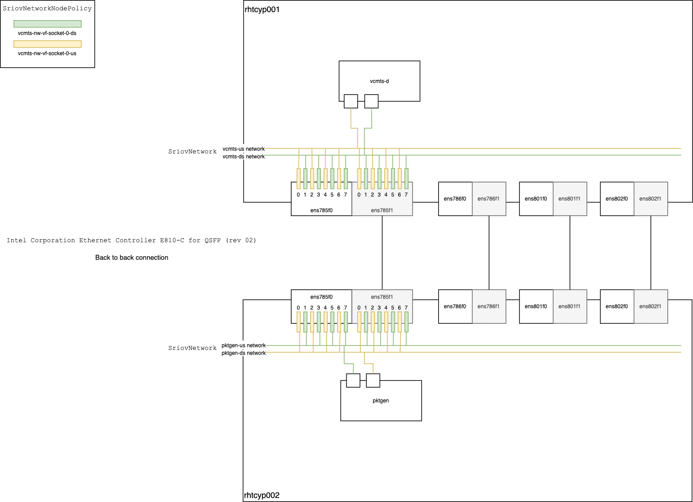

# Intel vCMTS on OpenShift

## Table of Contents

<!-- TOC -->
- [Introduction](#introduction)
- [Prerequisities](#prerequisities)
- [Build Container Images](#build-container-images)
- [SRIOV Configurationp](#sriov-configuration)
- [Monitoring](#monitoring)
- [Deploy the application](#deploy-the-application)
- [Start the application](#start-the-application)
<!-- TOC -->

## Introduction

This document describes how to build, install and run the Intel vCMTS reference dataplane system on Red Hat OpenShift Container Platform. Intel vCMTS includes a DPDK Pktgen based cable traffic generation system for upstream and downstream traffic simulation.

## Prerequisities

Ensure to have the following elements in hand and/or deployed. For the various operators, following the links to see how they can be deployed.

  - Intel vCMTS Package
  - Red Hat OpenShift version 4.8.20
    - Red Hat OpenShift Data Foundation
    - [Red Hat OpenShift Pipeline Operator](https://docs.openshift.com/container-platform/4.8/cicd/pipelines/installing-pipelines.html)
    - [SR-IOV Network Operator](https://docs.openshift.com/container-platform/4.8/networking/hardware_networks/installing-sriov-operator.html)
    - [Performance Addon Operator](https://docs.openshift.com/container-platform/4.8/scalability_and_performance/cnf-performance-addon-operator-for-low-latency-nodes.html#installing-the-performance-addon-operator_cnf-master)
    - [Grafana Operator](https://operatorhub.io/operator/grafana-operator)
  - Helm 3
  - Podman / Buildah (for local build only)

## Build Container Images
They are two ways to build the vCMTS related applications, please see [build options](build/README.md).

## Node configuration
In order to enable advanced node performance tunings, we are using the Performance Addon Operator.

The setup is comprised of two servers, one dedicated for packet generation, and one dedicated to run the vCMTS.

Both servers need to be configured with appropriate CPU isolation and Hugepages. Their corresponding profile has been defined and can be applied as follow

~~~
oc apply -f config/pao/vcmts-profile.yaml
oc apply -f config/pao/pktgen-profile.yaml
~~~

## SRIOV Configuration

Both servers are connected back-to-back through E810 network interface, that each of two ports.

Virtual functions (VFs) from the same physical function (PF) are split into two resource pools in order to segragate and dedicate  Upstream and Downstream traffic.

As such, each PF is divided into 8 VFs:
- even VFs are be for upstream traffic
- odd VFs are for downstream traffic

Here is an overall diagram showing the setup



Start by applying the `SriovNetworkNodePolicy` to configure the VF in the PFs.
~~~
oc apply -f config/sriov/node-policy/vcmts-us.yaml
oc apply -f config/sriov/node-policy/vcmts-ds.yaml
oc apply -f config/sriov/node-policy/pktgen-us.yaml
oc apply -f config/sriov/node-policy/pktgen-ds.yaml
~~~

Then create the `SriovNetwork` which will consume the resources previously created.

~~~
oc apply -f config/sriov/network/vcmts-us-nw.yaml
oc apply -f config/sriov/node-policy/vcmts-ds-nw.yaml
oc apply -f config/sriov/node-policy/pktgen-us-nw.yaml
oc apply -f config/sriov/node-policy/pktgen-ds-nw.yaml
~~~

The SR-IOV operator will generate `NetworkAttachmentDefinition` out of the created `SriovNetwork`. This is what will be used in the pod definition to attach it to an VF interface as defined in the network definition.
You can verify by running the following command.
~~~
$ oc get net-attach-def -n vcmts-build
NAME        AGE
pktgen-ds   15d
pktgen-us   15d
vcmts-ds    15d
vcmts-us    15d
~~~

## Monitoring

In order to monitor the overall solution's performance and health of the systems, the vCMTS comes with pre-built Grafana dashboard and monitoring capabilities.
These monitoring capabilities presently require a high level of privilege, given they rely on a shared collectd socket.

As such, some ordering is required during the setup, to fulfill dependencies. First collectd needs to be deployed, and then PCM can be deployed. Only after that, you can move to deploying the vCMTS application.

Start by setup OpenShift Prometheus to scrape user projects metrics; this will enable the collection of metrics from projects that are not system project (i.e. none openshift-* projects)
```
oc apply -f config/monitoring/prometheus-enable-user-workload.yaml
```

Load vCMTS Grafana Dashboard
```
oc kustomize config/monitoring/dashboards | oc apply -f -
```

Create Grafana Instance
```
oc create -f config/monitoring/grafana.yaml
```

Configure Grafna to use OpenShift thanos as proxy data source to retrieve prometheus data.
```
oc adm policy add-cluster-role-to-user cluster-monitoring-view -z grafana-serviceaccount -n vcmts-build
BEARER_TOKEN=$(oc serviceaccounts get-token grafana-serviceaccount -n vcmts-build)

echo "apiVersion: integreatly.org/v1alpha1
kind: GrafanaDataSource
metadata:
  name: prometheus-grafanadatasource
  namespace: vcmts-build
spec:
  datasources:
    - access: proxy
      editable: true
      isDefault: true
      jsonData:
        httpHeaderName1: 'Authorization'
        timeInterval: 5s
        tlsSkipVerify: true
      name: prometheus
      secureJsonData:
        httpHeaderValue1: 'Bearer ${BEARER_TOKEN}'
      type: prometheus
      url: 'https://thanos-querier.openshift-monitoring.svc.cluster.local:9091'
  name: prometheus-grafanadatasource.yaml" | oc apply -f -
```

Deploy collectd and collectd-exporter, along with OpenShift Prometheus metrics scrapper `ServiceMonitor`
```
oc create -f deploy/test-pod/collectd.yaml
```

Deploy PCM after collectd has been deployed, given it rely on the collectd socket to send the memory bandwidth utilization data.
~~~
oc create -f deploy/test-pod/pcm.yaml
~~~

## Monitoring

Setup OpenShift Prometheus to scrape user projects metrics
```
oc apply -f config/monitoring/prometheus-enable-user-workload.yaml
```

Load vCMTS Grafana Dashboard
```
oc kustomize config/monitoring/dashboards | oc apply -f -
```

Create Grafana Instance
```
oc create -f config/monitoring/grafana.yaml
```

Configure Grafna to use OpenShift thanos as proxy data source to retrieve prometheus data.
```
oc adm policy add-cluster-role-to-user cluster-monitoring-view -z grafana-serviceaccount -n vcmts-build
BEARER_TOKEN=$(oc serviceaccounts get-token grafana-serviceaccount -n vcmts-build)

echo "apiVersion: integreatly.org/v1alpha1
kind: GrafanaDataSource
metadata:
  name: prometheus-grafanadatasource
  namespace: vcmts-build
spec:
  datasources:
    - access: proxy
      editable: true
      isDefault: true
      jsonData:
        httpHeaderName1: 'Authorization'
        timeInterval: 5s
        tlsSkipVerify: true
      name: prometheus
      secureJsonData:
        httpHeaderValue1: 'Bearer ${BEARER_TOKEN}'
      type: prometheus
      url: 'https://thanos-querier.openshift-monitoring.svc.cluster.local:9091'
  name: prometheus-grafanadatasource.yaml" | oc apply -f -
```

Deploy collectd and collectd-exporter, along with OpenShift Prometheus metrics scrapper `ServiceMonitor`
```
oc create -f deploy/test-pod/collectd.yaml
```

## Deploy the application

Now that the monitoring stack is up and running, you can deploy the applications.

Start by deploying the vCMTS application

~~~
helm install vcmtsd deploy/patches/vcmtsd -n vcmts-build
~~~

Then deploy the pktgen application

~~~
helm install pktgen deploy/patches/pktgen -n vcmts-build
~~~

## Start the application

Finally, we are now ready to start the application.

First, get into the vCMTS terminal and execute the following command
~~~
/home/vcmts/vcmts-config/run_vcmtsd.sh
~~~

Then, get into the pktgen terminal, and execute the following command
~~~
/home/vcmts/pktgen-config/run_pktgen.sh
~~~
This will give you access to the pktgen cli. There, you can start sending traffic using the following command
~~~
start 0-1
~~~
And finally, from there, you can set the traffic rate to send either upstream or downstream. Here are examples:
~~~
set 0 rate 8
set 1 rate 8
~~~