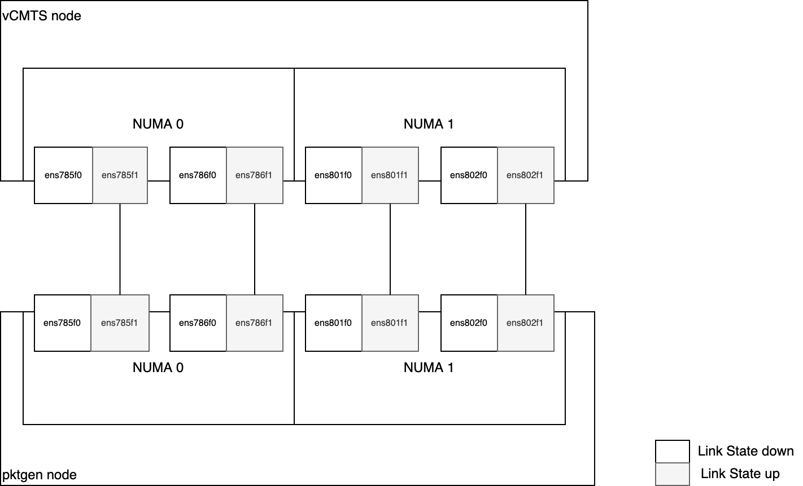

# Intel vCMTS on OpenShift

## Table of Contents

<!-- TOC -->
- [Introduction](#introduction)
- [Prerequisities](#prerequisities)
- [Build Container Images](#build-container-images)
- [Node configuration](#node-configuration)
  - [Machine configuration](#machine-configuration)
  - [Performance Addon](#performance-addon)
- [SRIOV Configuration](#sriov-configuration)
- [Monitoring](#monitoring)
- [Deploy the application](#deploy-the-application)
- [Start the application](#start-the-application)
<!-- TOC -->

## Introduction

This document describes how to build, install and run the Intel vCMTS reference dataplane system on Red Hat OpenShift Container Platform. Intel vCMTS includes a DPDK Pktgen based cable traffic generation system for upstream and downstream traffic simulation.

## Prerequisities

Ensure to have the following elements in hand and/or deployed. For the various operators, following the links to see how they can be deployed.

  - Intel vCMTS Package
  - Red Hat OpenShift version 4.8.20
    - Red Hat OpenShift Data Foundation
    - [Red Hat OpenShift Pipeline Operator](https://docs.openshift.com/container-platform/4.8/cicd/pipelines/installing-pipelines.html)
    - [SR-IOV Network Operator](https://docs.openshift.com/container-platform/4.8/networking/hardware_networks/installing-sriov-operator.html)
    - [Performance Addon Operator](https://docs.openshift.com/container-platform/4.8/scalability_and_performance/cnf-performance-addon-operator-for-low-latency-nodes.html#installing-the-performance-addon-operator_cnf-master)
    - [Grafana Operator](https://operatorhub.io/operator/grafana-operator)
  - Helm 3
  - Podman / Buildah (for local build only)

## Build Container Images
They are two ways to build the vCMTS related applications, please see [build options](build/README.md).

## Node configuration

### Machine configuration
By default, an OpenShift cluster have two node roles (`master` and `worker`), identified by their respective `MachineConfigPool` and `machineconfiguration.openshift.io/role` label.

Each `MachineConfigPool` is a collection of `MachineConfig` identified by the label `machineconfiguration.openshift.io/role`.

This is what will drive the underlying node operating system configuration. Learn more about this [here](https://docs.openshift.com/container-platform/4.8/post_installation_configuration/machine-configuration-tasks.html)

As part of the vCMTS environment, we need to dedicate and customize two worker nodes with specific configuration:
  - one node for traffic generation (that will host DPDK Pktgen application).
  - one node for Intel vCMTS application.

To do so, we start by adding labels to each node, identifying their function.

_FIXME: use only one label (the second label is used to deploy the vCMTS or pktgen)_

~~~
oc label $NODE_FOR_VCMTS node-role.kubernetes.io/vcmts: ''
oc label $NODE_FOR_VCMTS vcmts=true

oc label $NODE_FOR_PKTGEN node-role.kubernetes.io/pktgen: ''
oc label $NODE_FOR_PKTGEN vcmtspktgen: "true"
~~~

Then we  create a `MachineConfigPool` for each node type, identified by their label using a `nodeSelector`. Also, when creating the `MachineConfigPool`, the label `machineconfiguration.openshift.io/role` gets defined to identify `MachineConfig` belonging to that node role.

Both the vCMTS and pktgen `MachineConfigPool` will inherit from the `MachineConfig` targetting nodes having the `node-role.kubernetes.io/worker: ''` label, given it is part of their `machineConfigSelector`.
In addition to that, they will inhirit from their respective `MachineConfig`.

Review and create the MachineConfigPool. 
~~~
oc create -f config/mcp/vcmts.yaml
oc create -f config/mcp/pktgen.yaml
~~~

After a few minutes, they will have rendered their respective configuration (that is, so far, only comprised on `MachineConfig` of workers, given we haven't yet added any `MachineConfig` for our specific node types).

### Performance Addon
In order to enable advanced node performance tunings, we are using the Performance Addon Operator.

Both the vCMTS and pktgen nodes need to be configured with appropriate CPU isolation and Hugepages.

In our enrivonment, each node has two sockets, each with one CPU having 32 cores; for a total of 128 hyperthreaded cores.

Given the vCMTS required dedication of 4 cores per instance, to have 28 Service Groups, we need 28*4=112 cores.

As such, the vcmts profile is reserving 8 cores for house keeping and isolates the 120 remaining.

The pktgen only dedicates 2 cores per instance, but it is provided with similar configuration.

Their corresponding profiles have been defined and can be applied as follow.

~~~
oc apply -f config/pao/vcmts-profile.yaml
oc apply -f config/pao/pktgen-profile.yaml
~~~

This will generate `MachineConfig` targetting node identified by the `nodeSelector` field in the profile.

They can be seen using the following command

~~~
$ oc get MachineConfig -l machineconfiguration.openshift.io/role=vcmts
NAME                            GENERATEDBYCONTROLLER                      IGNITIONVERSION   AGE
50-nto-vcmts                                                               3.2.0             101d
50-performance-vcmts-profile0                                              3.2.0             101d
99-vcmts-generated-kubelet      1aeaf8c9c93dc772e65e23668dd435d06d833bcf   3.2.0             101d

$ oc get MachineConfig -l machineconfiguration.openshift.io/role=pktgen
NAME                             GENERATEDBYCONTROLLER                      IGNITIONVERSION   AGE
50-nto-pktgen                                                               3.2.0             101d
50-performance-pktgen-profile0                                              3.2.0             101d
99-pktgen-generated-kubelet-1    1aeaf8c9c93dc772e65e23668dd435d06d833bcf   3.2.0             101d
~~~

The machine config operator will see these new `MachineConfig` and will render the new target configuration for the respective `MachineConfigPool`. Once rendered, the configuration will be applied on the node part by the updated `MachineConfigPool`.

## SRIOV Configuration
Both servers are connected back-to-back with 4 E810 network interfaces (one port per NIC).

In order to have 28 Service Group, we need 14 VFs per PF, for a total of 56 VFs per server, because each instance will have dedicated upstream and downstream VF, i.e. 28*2=56.

Virtual functions (VFs) from the same physical function (PF) are split into two resource pools in order to segragate and dedicate upstream and downstream traffic. In order to have 28 Service Group, we need 14 VFs per PF. The first 7 will be for downstream traffic and the last 7 for upstream traffic.

Also, as mentioned previously, each NUMA node have two NICs; in order to cross NUMA bounderies, we are creating one upstream and downstream network per NIC, that will be assigned following Service Group ID. This is the case for both vCMTS and pktgen.

So 
- the first 7 Service Groups (0-6) will be on NIC 0 of NUMA 0
- the following 7 Service Groups(7-13) will be on NIC 1 of NUMA 0
- the following 7 Service Groups(14-20) will be on NIC 2 of NUMA 1
- the following 7 Service Groups(21-27) will be on NIC 3 of NUMA 2

This will ensure maximum throughput efficiency given the NIC are cabled back to back.

_Note: the SRIOV configuration would be different in a routed fabric_

Here is an overall diagram showing the setup



Start by applying the `SriovNetworkNodePolicy` to configure the VF in the PFs.
~~~
oc apply -f config/sriov/node-policy/
~~~

You can see the created network policies as follow

~~~
$ oc get SriovNetworkNodePolicy -n openshift-sriov-network-operator
NAME          AGE
default       100d
pktgen-ds-0   5d20h
pktgen-ds-1   5d20h
pktgen-ds-2   5d20h
pktgen-ds-3   5d20h
pktgen-us-0   5d20h
pktgen-us-1   5d20h
pktgen-us-2   5d20h
pktgen-us-3   5d20h
vcmts-ds-0    5d20h
vcmts-ds-1    5d20h
vcmts-ds-2    5d20h
vcmts-ds-3    5d20h
vcmts-us-0    5d20h
vcmts-us-1    5d20h
vcmts-us-2    5d20h
vcmts-us-3    5d20h
~~~

Now, we can create the `SriovNetwork`, which will consume the resources previously created.

~~~
oc apply -f config/sriov/network/
~~~

Validate all the network have been created

~~~
$ oc get SriovNetwork -n openshift-sriov-network-operator
NAME          AGE
pktgen-ds-0   5d20h
pktgen-ds-1   5d20h
pktgen-ds-2   5d20h
pktgen-ds-3   5d20h
pktgen-us-0   5d20h
pktgen-us-1   5d20h
pktgen-us-2   5d20h
pktgen-us-3   5d20h
vcmts-ds-0    5d20h
vcmts-ds-1    5d20h
vcmts-ds-2    5d20h
vcmts-ds-3    5d20h
vcmts-us-0    5d20h
vcmts-us-1    5d20h
vcmts-us-2    5d20h
vcmts-us-3    5d20h
~~~

The SR-IOV operator will generate `NetworkAttachmentDefinition` out of the created `SriovNetwork`. 

This is what will be reference in the pod annotation `k8s.v1.cni.cncf.io/networks` to properly create and attach the VF interfaces.

You can verify the network attachement are created by running the following command.
~~~
$ oc get net-attach-def -n vcmts-build
NAME          AGE
pktgen-ds-0   5d20h
pktgen-ds-1   5d20h
pktgen-ds-2   5d20h
pktgen-ds-3   5d20h
pktgen-us-0   5d20h
pktgen-us-1   5d20h
pktgen-us-2   5d20h
pktgen-us-3   5d20h
vcmts-ds-0    5d20h
vcmts-ds-1    5d20h
vcmts-ds-2    5d20h
vcmts-ds-3    5d20h
vcmts-us-0    5d20h
vcmts-us-1    5d20h
vcmts-us-2    5d20h
vcmts-us-3    5d20h
~~~

## Monitoring

In order to monitor the overall solution's performance and health, vCMTS comes with pre-built Grafana dashboard and monitoring capabilities.
These monitoring capabilities presently require a high level of privilege, given they rely on a shared collectd socket.

As such, some ordering is required during the setup. 

1. First collectd needs to be deployed
2. Then PCM can be deployed
3. vCMTS application can be deployed
4. pktgen applications can be deployed

### Collectd

vCMTS requires a collectd socket to provide metrics; in order to retrieve these metrics, we are creating a collectd instance that will provide the socket to vCMTS, and a collectd exporter that will expose the collected metrics on port `9103`, so OpenShift Prometheus instance can scrape them.

But default, OpenShift Prometheus instance is only scraping metrics from the platform (i.e. openshift-* namespace). In order for OpenShift Prometheus to scrape user projects metrics we need to enable "user workload metrics". 

```
oc apply -f config/monitoring/prometheus-enable-user-workload.yaml
```

Once done, we can deploy collectd and collectd-exporter, along with OpenShift Prometheus configuration `ServiceMonitor`
```
oc create -f deploy/tools/collectd.yaml
```

### Grafana

Load vCMTS Grafana Dashboards
```
oc kustomize config/monitoring/dashboards | oc apply -f -
```

Create Grafana Instance
```
oc create -f config/monitoring/grafana.yaml
```

Configure Grafna to use OpenShift thanos as proxy data source to retrieve prometheus data.
```
oc adm policy add-cluster-role-to-user cluster-monitoring-view -z grafana-serviceaccount -n vcmts-build
BEARER_TOKEN=$(oc serviceaccounts get-token grafana-serviceaccount -n vcmts-build)

echo "apiVersion: integreatly.org/v1alpha1
kind: GrafanaDataSource
metadata:
  name: prometheus-grafanadatasource
  namespace: vcmts-build
spec:
  datasources:
    - access: proxy
      editable: true
      isDefault: true
      jsonData:
        httpHeaderName1: 'Authorization'
        timeInterval: 5s
        tlsSkipVerify: true
      name: prometheus
      secureJsonData:
        httpHeaderValue1: 'Bearer ${BEARER_TOKEN}'
      type: prometheus
      url: 'https://thanos-querier.openshift-monitoring.svc.cluster.local:9091'
  name: prometheus-grafanadatasource.yaml" | oc apply -f -
```

### Processor Counter Monitor 

In order to measure the aggregate memory bandwidth consumed by the cores, PCM tool is used, and it relies on the collectd socket to send the memory bandwidth utilization data.

As such, deploy PCM after collectd has been deployed 
~~~
oc create -f deploy/tools/pcm.yaml
~~~

## Deploy the application

Now that the monitoring stack is up and running, you can deploy the applications, that will automatically start.

Start by deploying the vCMTS application

~~~
helm install vcmtsd deploy/applications/vcmtsd -n vcmts-build
~~~

Then deploy the pktgen application

~~~
helm install pktgen deploy/applications/pktgen -n vcmts-build
~~~

## Generate traffic

Finally, in order to control Pktgen traffic generation, helper scripts have been build and packaged into a pod.

To get started, deploy the pod

~~~
oc apply -f deploy/tools/pktgen-config-pod.yaml
~~~

Use to following command to start the traffic generator

~~~
oc get pods -n vcmts-build -l app=pktgen-helper -o name | xargs -I {} /bin/bash -c 'oc rsh -n vcmts-build {} /opt/scripts/start.sh'
~~~

Use to following command to set traffic rate.

The first argument is either 0 or 1, respectively idenfitying upstream and downstream traffic.
The seconf argument is the rate the apply.

Here is an example for applying 2.3G of traffic upstream and 7.3G of traffic downstream.
~~~
oc get pods -n vcmts-build -l app=pktgen-helper -o name | xargs -I {} /bin/bash -c 'oc rsh -n vcmts-build {} /opt/scripts/set.sh 0 2.3'
oc get pods -n vcmts-build -l app=pktgen-helper -o name | xargs -I {} /bin/bash -c 'oc rsh -n vcmts-build {} /opt/scripts/set.sh 1 7.3'
~~~