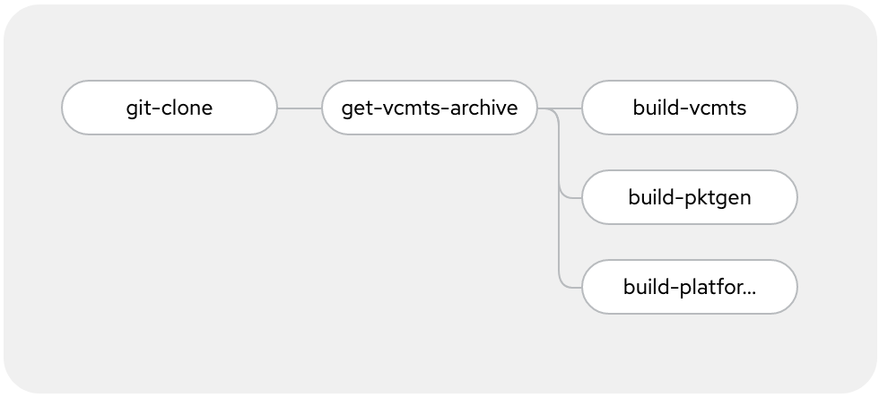

## Build Container Images

You can either build the vCMTS related container manually or using a Tekton pipeline.

### Pipeline Build

Prerequisite:
- have the vCMTS artifacts available by URL so the pipeline can retrieve them.

If you need to host the vCMTS artifact in an HTTP server, the [httpd](httpd) folder contain the necessary manifests and documentation to do so.

#### OpenShift Pipeline

This requires [OpenShift Pipelines](https://docs.openshift.com/container-platform/4.9/cicd/pipelines/installing-pipelines.html) to be installed.

Start by creating the namespace in which the pipeline will be deployed:

~~~
$ oc create ns vcmts-build
~~~

##### Authentication to git repository

In order for the pipeline to authenticate to the Github repository, you must provide have a key-pair with the public key in your Github account, and load the private key into the OpenShift project.

See the `github-auth-secret_EXAMPLE.yaml` and replace `YOUR_BASE64_ENCODED_PRIVATE_KEY` with your encoded private key.

Then apply the secret:
~~~
$ oc create -f pipeline/github-auth-secret_EXAMPLE.yaml
~~~

##### Authentication to internal image registry

~~~
oc policy add-role-to-user registry-editor -z pipeline -n vcmts-build
~~~

##### Pipeline share workspace

In order to pass data between the pipeline tasks, a shared workspace is setup.

~~~
oc apply -f pipeline/vcmts-build-workspace-pvc.yaml
~~~

##### Pipeline tasks

The pipeline is comprised of 4 tasks, as follow:



The details for the `get-vcmts-archive` and `build-*` tasks are in `pipeline/tasks` folder

Create the tasks:

~~~
$ oc create -f pipeline/tasks/build-container.yaml
$ oc create -f pipeline/tasks/get-vcmts-archive.yaml
~~~

##### Pipeline

The pipeline supports the following parameters, with their according default value.
Cuztomize as needed.

    - default: >-
        https://01.org/sites/default/files/downloads/intel-vcmtsd-v21-10-0.tar.gz
      description: URL to the Intel vCMTS package
      name: VCMTSD_PACKAGE_URL
      type: string
    - default: 21.10.0
      description: Intel VCMTS package version
      name: VCMTS_VERSION
      type: string
    - default: 'image-registry.openshift-image-registry.svc:5000'
      description: Container Registry where to save the images
      name: REGISTRY_URL
      type: string
    - default: >-
        https://01.org/sites/default/files/downloads/intel-vcmtsd-fixedsz-tp-21.10.0.tar.bz2
      description: 'URL to Intel vCMTS fixedsz traffic policies '
      name: VCMTSD_FIXEDSZ_TP_URL
      type: string


Create the pipeline:

~~~
$ oc create -f pipeline/pipeline.yaml
~~~

##### Run the pipeline

Finally, you can now deploy the pipeline run object to trigger the build:

~~~
$ oc create -f pipeline/pipeline-run.yaml
~~~

After +/- 15mn, when the build is done, you should see this:

~~~
$ oc get imagestream -n vcmts-build
NAME           IMAGE REPOSITORY                                                                          TAGS      UPDATED
vcmts          default-route-openshift-image-registry.apps.npgcable.intel.com/vcmts-build/vcmts          21.10.0   2 minutes ago
vcmts-pktgen   default-route-openshift-image-registry.apps.npgcable.intel.com/vcmts-build/vcmts-pktgen   21.10.0   7 minutes ago
~~~

### Local Build

Clone this repository.

```
$ git clone https://github.com/openshift-telco/ocp-intel-cvmts
```

Acquire Intel vCMTS package and copy to `ocp-intel-vcmts` directory. 
Example package: `intel-vcmtsd-v21-10-0-beta.tar.gz`.
Edit `build_config` and adjust as needed according to required build versions. Example:

```
$ cat build_config 
# Intel VCMTS package version
VCMTS_VERSION="21.10.0"
# Registry to use to store the built image
REGISTRY_URL="localhost"
```

#### vCMTSD

Launch build script.

```
$ . build_config
$ ./build_vcmts.sh
```

#### Pktgen

Launch build script.

```
$ . build_config
$ ./build_pktgen.sh
```