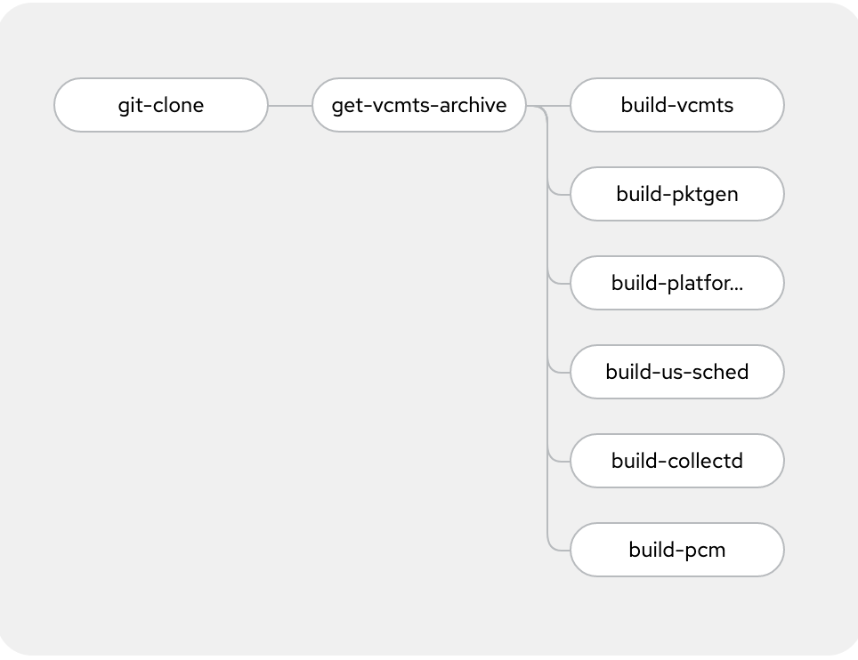

## Build Container Images

You can either build the vCMTS related container manually or using a Tekton pipeline.

<!-- TOC -->
- [Pipeline Build](#pipeline-build)
- [Local Build](#local-build)
<!-- TOC -->

Clone this repository.

```
$ git clone https://github.com/openshift-telco/ocp-intel-cvmts
```

### Pipeline Build

Acquire Intel vCMTS packages and/or have it available through URLs.
If you need to host the vCMTS artifacts in an HTTP server, the [httpd](httpd) folder contain the necessary manifests and documentation to do so.

#### OpenShift Pipeline

This requires [OpenShift Pipelines](https://docs.openshift.com/container-platform/4.9/cicd/pipelines/installing-pipelines.html) to be installed.

Start by creating the namespace in which the pipeline will be deployed:

~~~
$ oc create ns vcmts-build
~~~

##### Authentication to git repository

In order for the pipeline to authenticate to the Github repository, you must provide have a key-pair with the public key in your Github account, and load the private key into the OpenShift project.

See the `github-auth-secret_EXAMPLE.yaml` and replace `YOUR_BASE64_ENCODED_PRIVATE_KEY` with your encoded private key.

Then apply the secret:
~~~
$ oc create -f pipeline/github-auth-secret_EXAMPLE.yaml
~~~

##### Authentication to internal image registry

Provide the `pipeline` ServiceAccount with the `registry-editor` role.

~~~
$ oc policy add-role-to-user registry-editor -z pipeline -n vcmts-build
~~~

##### Pipeline share workspace

In order to pass data between the pipeline tasks, a shared workspace is setup.

~~~
$ oc apply -f pipeline/vcmts-build-workspace-pvc.yaml
~~~

##### Pipeline tasks

The pipeline is comprised of 4 tasks, as follow:



The details for the `get-vcmts-archive` and `build-*` tasks are in `pipeline/tasks` folder

Create the tasks:

~~~
$ oc create -f pipeline/tasks/build-container.yaml
$ oc create -f pipeline/tasks/get-vcmts-archive.yaml
~~~

##### Pipeline

The pipeline supports the following parameters, with their according default value.
Customize as needed.

    - default: >-
        https://01.org/sites/default/files/downloads/intel-vcmtsd-v21-10-0.tar.gz
      description: URL to the Intel vCMTS package
      name: VCMTSD_PACKAGE_URL
      type: string
    - default: 21.10.0
      description: Intel VCMTS package version
      name: VCMTS_VERSION
      type: string
    - default: 'image-registry.openshift-image-registry.svc:5000'
      description: Container Registry where to save the images
      name: REGISTRY_URL
      type: string
    - default: >-
        https://01.org/sites/default/files/downloads/intel-vcmtsd-fixedsz-tp-21.10.0.tar.bz2
      description: 'URL to Intel vCMTS fixedsz traffic policies '
      name: VCMTSD_FIXEDSZ_TP_URL
      type: string


Create the pipeline:

~~~
$ oc create -f pipeline/pipeline.yaml
~~~

##### Run the pipeline

Finally, you can now deploy the pipeline run object to trigger the build:

~~~
$ oc create -f pipeline/pipeline-run.yaml
~~~

After +/- 15mn, when the build is done, you should see this:

~~~
$ oc get imagestream -n vcmts-build
NAME                             IMAGE REPOSITORY                                                                                            TAGS      UPDATED
vcmts-d                          default-route-openshift-image-registry.apps.npgcable.intel.com/vcmts-build/vcmts-d                          21.10.0   4 days ago
vcmts-pktgen                     default-route-openshift-image-registry.apps.npgcable.intel.com/vcmts-build/vcmts-pktgen                     21.10.0   4 days ago
vcmts-platform-management-tool   default-route-openshift-image-registry.apps.npgcable.intel.com/vcmts-build/vcmts-platform-management-tool   21.10.0   4 days ago
vcmts-us-sched                   default-route-openshift-image-registry.apps.npgcable.intel.com/vcmts-build/vcmts-us-sched                   21.10.0   4 days ago
~~~

### Local Build

In order to build locally, we will use the `rhel/buildah` container image, in order to make the build self-contained, not requiring any dependency, beside buildah.

Here are the steps to build locally:

1. Acquire Intel vCMTS package and copy to `ocp-intel-vcmts/build` directory. 
  Example package: `intel-vcmtsd-v21-10-0-beta.tar.gz`.

2. Edit `build_config` and adjust as needed according to required build versions. Example:
    ```
    $ cat build_config 
    # Intel VCMTS package version
    VCMTS_VERSION="21.10.0"
    # Registry to use to store the built image
    REGISTRY_URL="localhost"
    ```

3. Create a local container that will be the build node, and mount the git repo containing the vCMTS archive
    ```
    podman run -it --mount type=bind,source=ocp-intel-vcmts,target=/ocp-intel-vcmts registry.redhat.io/rhel8/buildah
    ```

4. Build a container
    - uncomment in the build_$COMPONENT.sh the `source build_config` - line 10
    - run the script to build the component of choice.
      Example: 
      ```
      $ ./build_vcmts.sh
      ```